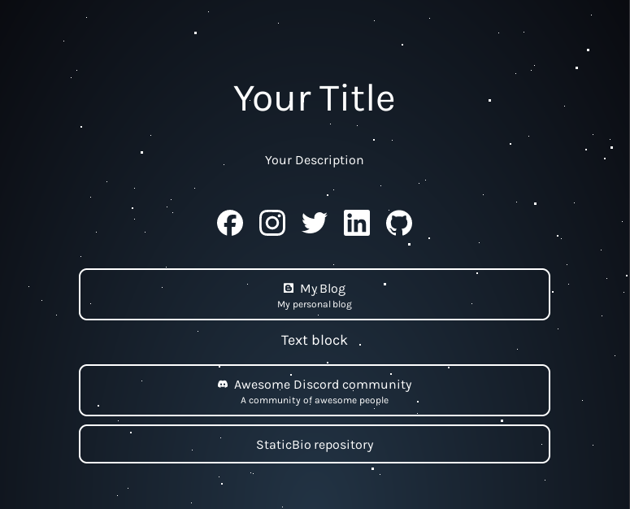

# StaticBio - A static bio page generator



## What is this?

StaticBio is a static bio page generator built with Astro. It's a simple way to create a bio page for yourself, or for your team.

## How to use it?

1. Clone this repository
2. Edit the files in the `data` folder to your liking
3. Run `npm run build` to generate the site
4. Upload the contents of the `dist` folder to your web server

## How to customize it?

There are two themes included, the default theme, and the galaxy theme. To switch themes, edit the `Theme` import path in `src/pages/index.astro` to either `default` or `galaxy`.

To create your own theme, create a folder in `src/layouts/themes` with the name of your theme. The folder should contain an `theme.astro` file. The `theme.astro` file accepts the following props:
```typescript
interface ThemeProps {
    config: Config;     // Site configuration
    blocks: Block[];    // Blocks of content array
    social: Social[];   // Social links array
}
```

## Project structure

```text
/
├── data/
│   ├── avatar.jpg  # Your avatar
│   ├── blocks.ts   # Blocks of content
│   ├── config.ts   # Site configuration
│   └── social.ts   # Social links
└── src/
    ├── layouts/
    │   └── themes/
    │       ├── default/    # Default theme
    │       └── galaxy/     # Galaxy theme
    └── pages/
        └── index.astro     # Main page
```